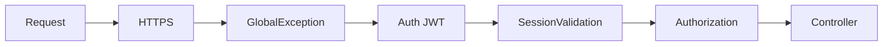
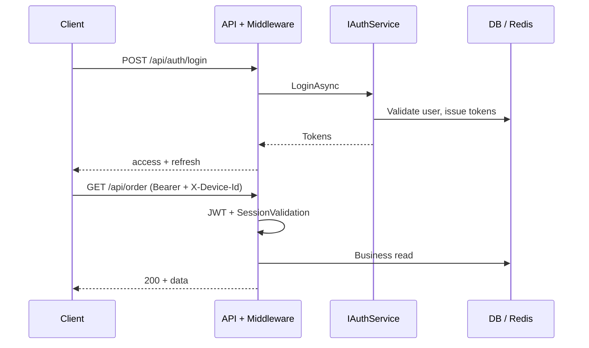
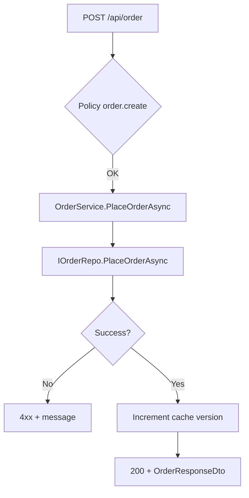
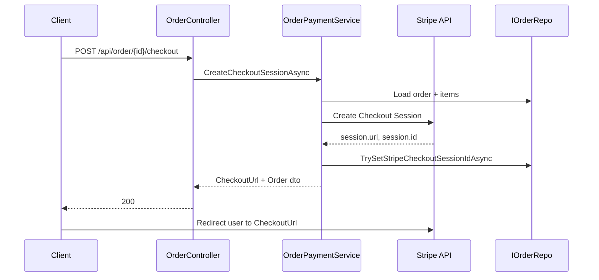
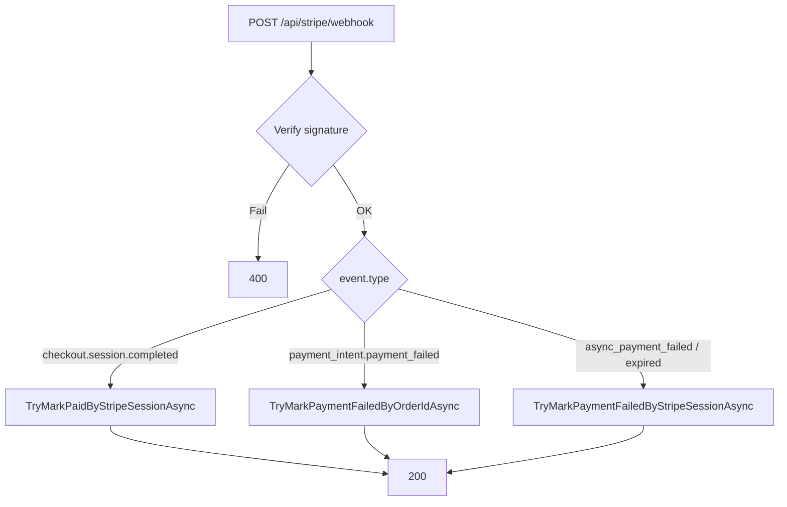

# Workflow và phân tích luồng — Ecommerce API

Tài liệu mô tả **các luồng nghiệp vụ chính** từ HTTP đến persistence, **thứ tự middleware**, và **phân tích ngắn** (điểm phụ thuộc, cache, thanh toán). Bổ sung cho [`PROJECT_STRUCTURE_AND_FILES.md`](./PROJECT_STRUCTURE_AND_FILES.md), [`ACCESS_REFRESH_TOKEN_FLOW.md`](./ACCESS_REFRESH_TOKEN_FLOW.md), [`AUTH_POLICY_AND_PUBLIC_API.md`](./AUTH_POLICY_AND_PUBLIC_API.md) (nếu có).

---

## 1. Pipeline HTTP (thứ tự xử lý)

Luồng request đi qua `Program.cs` theo thứ tự sau (sau `UseHttpsRedirection`):

| Bước | Thành phần | Vai trò |
|------|------------|---------|
| 1 | `GlobalExceptionMiddleware` | Bắt exception, chuẩn hóa response lỗi. |
| 2 | Serilog request logging | Ghi method, path, status, thời gian. |
| 3 | `UseAuthentication` | Giải mã JWT → `ClaimsPrincipal`. |
| 4 | `SessionValidationMiddleware` | Chỉ khi user đã authenticated: kiểm tra `sid`/`sv`/`fp`, JTI blacklist, fingerprint khớp header `X-Device-Id`. |
| 5 | `UseAuthorization` | Policy permission (`[Authorize(Policy = "...")]`) và role mặc định. |

**Ngoại lệ:**

- **`POST /api/stripe/webhook`**: `AllowAnonymous`; nhánh `UseWhen` bật **buffering body** để đọc raw JSON phục vụ verify chữ ký Stripe (xem `Program.cs`).
- Các endpoint `[AllowAnonymous]` (vd. đăng ký, đăng nhập, refresh, webhook) không chạy logic session đầy đủ như user đã login (middleware session chỉ “siết” khi `IsAuthenticated`).

---

## 2. Tổng quan workflow theo nghiệp vụ

| Workflow | Entry API | Service chính | Lưu ý |
|----------|-----------|---------------|--------|
| Đăng ký / đăng nhập / refresh | `AuthController` | `IAuthService` | Refresh rotation, session version, fingerprint. |
| Logout | `POST api/auth/logout` | `IAuthService` | Blacklist JTI / vô hiệu phiên (theo triển khai). |
| CRUD User / Role / Permission | `User`, `Role`, `Permission` | `IUserService`, `IRoleService`, … | Policy permission động. |
| Catalog | `Category`, `Product` | `ICategoryService`, `IProductService` | Cache version sau thay đổi (increment key). |
| Đặt hàng | `POST api/order` | `IOrderService` → `IOrderRepo.PlaceOrderAsync` | Transaction/stock trong repo. |
| Thanh toán Stripe | `POST api/order/{id}/checkout` | `IOrderPaymentService` | Một `currency` từ `Stripe:DefaultCurrency`. |
| Webhook Stripe | `POST api/stripe/webhook` | `IOrderRepo` trực tiếp | Mark paid / failed / expired. |
| Admin đơn hàng | `AdminOrderController` | `IOrderAdminService` | Phân trang, cancel, return, PATCH status (query). |

---

## 3. Workflow: xác thực và phiên (tóm tắt)

**Đăng nhập:** Client gửi thông tin đăng nhập (+ device id nếu có) → `AuthService` xác thực, tạo access token (JWT có claim `sid`, `sv`, `fp`, `jti`…) và refresh token → client lưu và gửi `Authorization: Bearer` + `X-Device-Id` cho request sau.

**Request có Bearer:** Pipeline giải JWT → `SessionValidationMiddleware` đối chiếu session còn hiệu lực, fingerprint, blacklist.

**Refresh:** Endpoint refresh (không dùng access token cũ như login) — chi tiết token rotation xem [`ACCESS_REFRESH_TOKEN_FLOW.md`](./ACCESS_REFRESH_TOKEN_FLOW.md).

---

## 4. Workflow: đặt hàng (Place order)

1. Client gọi **`POST /api/order`** với policy **`order.create`**, body `CreateOrderDto` (danh sách `productId`, `quantity`).
2. `OrderService.PlaceOrderAsync` map sang `OrderLineInput`, gọi **`IOrderRepo.PlaceOrderAsync`**.
3. Repo thực hiện logic nghiệp vụ (kiểm tra tồn, giá tại thời điểm mua, tạo `Order` + `OrderItem`, cập nhật stock trong transaction — theo triển khai repo).
4. Thành công → **`ICacheService.IncrementAsync`** (category version) để invalidate cache phía catalog nếu có consumer dùng version key.
5. Trả về `OrderResponseDto` (trạng thái thường là **Pending**, **NotPaid**).

**Phân tích:** Điểm “single writer” cho tính nhất quán đơn/stock là **repository**; Application không mở transaction thủ công nếu repo đã gói UoW/transaction.

---

## 5. Workflow: Stripe Checkout

1. Đơn ở trạng thái chờ thanh toán → client gọi **`POST /api/order/{id}/checkout`** (policy **`order.checkout`**).
2. `OrderPaymentService.CreateCheckoutSessionAsync`:
   - Kiểm tra user, order thuộc user, `Status == Pending`, chưa paid.
   - Đọc **`Stripe:DefaultCurrency`** (mặc định `usd`), build `line_items` với `PriceData` (số tiền nhỏ nhất theo currency: USD × 100 cents, v.v.).
   - Gắn **metadata** `orderId` trên Session và **PaymentIntentData.Metadata** (phục vụ webhook / lỗi thanh toán).
   - `SessionService.CreateAsync` → lưu **`StripeCheckoutSessionId`** lên order qua repo.
3. Response chứa **`CheckoutUrl`** — client redirect user tới Stripe Hosted Checkout.

**Phân tích:** Một session = **một currency** cấu hình; hiển thị đa tiền tệ hoặc PM (QR, ví) trên trang Stripe phụ thuộc **Dashboard Stripe** và vị trí khách, không phải multi-currency trong code session.

---

## 6. Workflow: Stripe Webhook

1. Stripe gửi **`POST /api/stripe/webhook`** với body raw + header **`Stripe-Signature`**.
2. Controller đọc body, `EventUtility.ConstructEvent` (verify secret).
3. Xử lý theo `type`:
   - **`checkout.session.completed`** + `payment_status == paid` → **`TryMarkPaidByStripeSessionAsync`** (idempotent / khớp session id).
   - **`payment_intent.payment_failed`** → đọc `orderId` từ **metadata** → `TryMarkPaymentFailedByOrderIdAsync`.
   - **`checkout.session.async_payment_failed`** / **`checkout.session.expired`** → cập nhật lỗi theo session id (theo repo).

Luôn trả **`200 Ok`** sau khi xử lý (hoặc `BadRequest` nếu signature sai) để Stripe không retry vô hạn khi lỗi client.

**Phân tích:** Webhook là **nguồn sự thật** cho “đã thanh toán”; không nên chỉ dựa redirect success URL mà không xác nhận event (redirect có thể spoof hoặc user đóng tab sớm).

---

## 7. Workflow: admin quản lý đơn

- **`GET /api/admin/orders`** — danh sách phân trang (`order.manage.read`).
- **`GET /api/admin/orders/user/{userId}`** — đơn theo user.
- **`GET /api/admin/orders/{id}`** — chi tiết.
- **`PUT .../cancel`**, **`POST .../approve-return`**, **`PATCH .../status?newStatus=...`** — policy **`order.manage.update`**; status fulfillment qua query (enum string, vd. `Shipping`, `Completed`).

Service layer áp rule chuyển trạng thái (khớp domain `OrderStatus`) và gọi repo.

---

## 8. Workflow: hoàn hàng (user + admin)

1. User (**policy `order.cancel`**): **`POST /api/order/{id}/return-request`** — chỉ khi đơn đã hoàn thành và đã thanh toán (theo `OrderService`).
2. Admin: **`POST /api/admin/orders/{id}/approve-return`** — duyệt, hủy đơn và hoàn stock (theo `OrderAdminService` / repo).

---

## 9. Phân tích chéo (cross-cutting)

| Chủ đề | Triển khai trong dự án |
|--------|-------------------------|
| **Response thống nhất** | `ApiResponse<T>`, `BaseController`, validation `ApiBehaviorOptions`. |
| **Quyền** | `[Authorize(Policy = "permission.name")]` + `PermissionAuthorizationHandler` đọc permission từ DB/cache theo user. |
| **Cache** | `ICacheService` — Redis hoặc Memory; key qua `CacheKeyGenerator`. |
| **Logging** | Serilog + request logging; webhook log cảnh báo khi không khớp order. |
| **Khởi động** | `MigrateAsync` + `DataSeeder.SeedAdminAsync` — đảm bảo schema và tài khoản admin tối thiểu. |
| **Enum JSON** | `JsonStringEnumConverter` toàn cục; một số enum có attribute / Swagger `MapType` cho OpenAPI. |

---

## 10. Rủi ro và hướng kiểm thử

- **Webhook:** Cần test signature sai, event trùng, order không tồn tại — hiện có unit test repo/Stripe một phần; có thể bổ sung test integration với payload mẫu.
- **Checkout:** Secret key test/live, URL success có `{CHECKOUT_SESSION_ID}` — đã validate trong service.
- **Session:** Thiếu `X-Device-Id` hoặc token cũ không có `sid`/`sv`/`fp` → 401 — cần tài liệu cho client (Swagger security scheme `DeviceId`).

---

## 11. Tài liệu liên quan

| File | Nội dung |
|------|----------|
| [`PROJECT_STRUCTURE_AND_FILES.md`](./PROJECT_STRUCTURE_AND_FILES.md) | Cấu trúc project và vai trò thư mục. |
| [`ACCESS_REFRESH_TOKEN_FLOW.md`](./ACCESS_REFRESH_TOKEN_FLOW.md) | Luồng refresh token chi tiết. |
| [`UNIT_TEST_PLAN_SERVICES.md`](./UNIT_TEST_PLAN_SERVICES.md) | Kế hoạch test service. |
| [`LOGGING.md`](./LOGGING.md) | Cấu hình log. |

---

*Tài liệu phản ánh kiến trúc tại thời điểm tạo; khi thêm endpoint hoặc đổi middleware, nên cập nhật mục tương ứng.*
